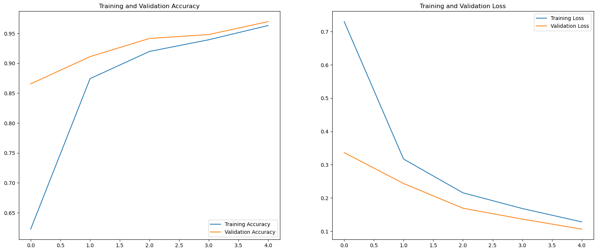
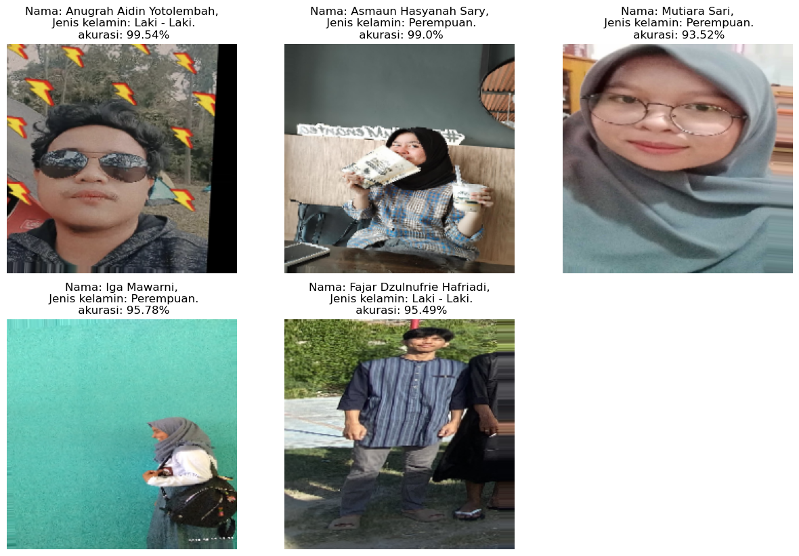

# Final Project Deep Learning
Person Classification with Gender using VGG16 Model
- Task by <b>Andi Hendra, S.Si., M.Kom.</b>


## Team Member

- Anugrah Aidin Yotolembah (<b>F551 20 093</b>)
- Fajar Dzulnufrie Hafriadi (<b>F551 20 089</b>)
- Asmaun Hasyanah Sary (<b>F551 20 092</b>)
- Mutiara Sari Muti (<b>F551 20 091</b>)
- Iga Mawarni (<b>F551 20 099</b>)


## Workflow

    1. Load Data
    2. Preprocessing Data
    3. Creating Model
    4. Training/Validation with Visualization
    5. Testing including visual and caption
## Library

```python
import numpy as np
import pandas as pd
import os
from tensorflow.keras.models import Sequential
from tensorflow.keras.layers import Dense, Dropout, Conv2D, MaxPooling2D, Flatten
import tensorflow as tf
import matplotlib.pyplot as plt
from tensorflow.keras.preprocessing.image import ImageDataGenerator
from tensorflow.keras.applications import VGG16
```
## Train & Validation Visual



## Final Ouput with multi-output


